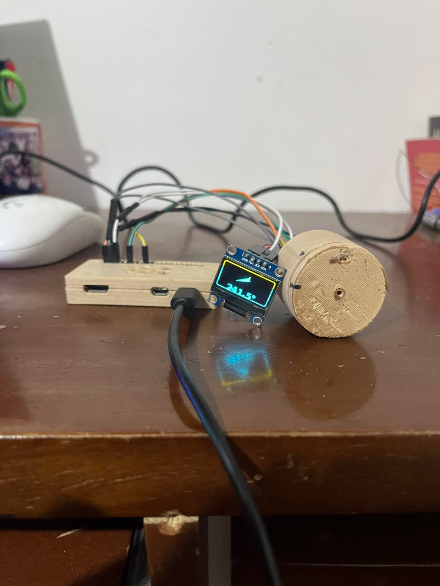
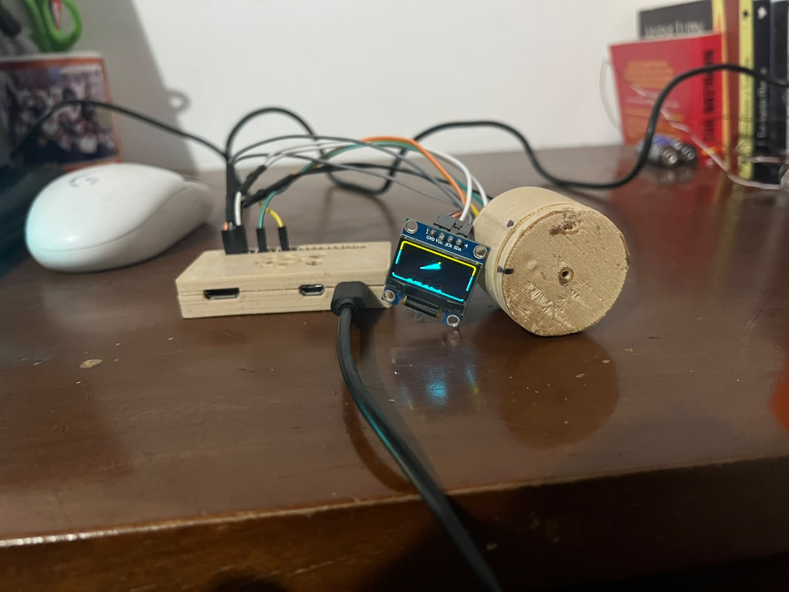
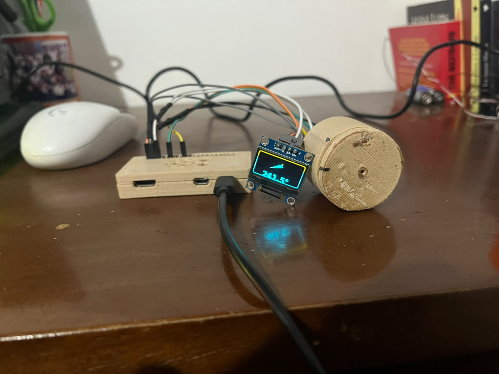

# Steer-by-Wire Portfolio

Repositorio de portfolio y banco de pruebas para una direccion steer-by-wire
basada en Raspberry Pi, sensor AS5600, OLED de banco y actuador UIM.

## Demo rapida

```bash
cd ~/Documentos/steer-by-wire
source .venv/bin/activate
python3 tools/steer_by_wire_runtime.py
```

Con eso se levanta el banco de pruebas que ya deja ver:

- lectura del AS5600
- flecha de direccion en la OLED
- base lista para integrar el motor cuando este el gateway disponible

## Resumen

El proyecto documenta:

- la lectura del volante con `AS5600`
- la visualizacion en `OLED SSD1306`
- el lazo de software en `Raspberry Pi Zero 2`
- la integracion con el actuador por `RS232`/`CAN`
- la evolucion del hardware de banco y las decisiones de arquitectura

## Estado actual

Hay dos niveles de integracion:

- **Banco de sensing**: `AS5600` + `OLED` ya funcionando
- **Banco de actuacion**: ruta serial/CAN en evaluacion con el hardware del laboratorio

## Que hay dentro

- `docs/` decisiones tecnicas, arquitectura y pruebas
- `hardware/` CAD y piezas impresas del banco
- `tools/` scripts de control y visualizacion
- `thesis-latex/` estructura para convertir el proyecto en tesis
- `docs/evidence/` fotos y video del montaje real

## Evidencia del banco

Estas son las pruebas que ya quedaron guardadas dentro del repositorio:

| Foto 1 | Foto 2 | Foto 3 |
| --- | --- | --- |
|  |  |  |

- Video corto de la prueba: [WhatsApp Video 2026-08-04 at 9.38.31 PM.mp4](docs/evidence/2026-08-04/WhatsApp%20Video%202026-08-04%20at%209.38.31%20PM.mp4)

## Pregunta de hardware abierta

Se esta evaluando reemplazar la cadena `USB-RS232 + RS232-CAN gateway` por una
placa HAT para Raspberry Pi con interfaz `CAN` real y, si aplica, `RS485`.
La decision final depende de que el HAT exponga `CAN` utilizable en Linux
(`SocketCAN`) y no solo un puerto `RS485`.

## Documentacion principal

- [docs/README.md](docs/README.md) indice general de la documentacion
- [docs/hardware-evaluation.md](docs/hardware-evaluation.md) criterio realista para decidir el cambio de hardware
- [docs/arquitectura-uim2513-rs232-can.md](docs/arquitectura-uim2513-rs232-can.md) arquitectura del enlace actual
- [docs/manual-as5600-rpi-zero-2w.md](docs/manual-as5600-rpi-zero-2w.md) manual de banco para sensor y OLED
- [docs/repo-assets.md](docs/repo-assets.md) lista de fotos, videos y capturas utiles para portfolio
- [docs/evidence/2026-08-04/README.md](docs/evidence/2026-08-04/README.md) evidencia inicial del banco

## Software util

- `tools/oled_compass.py` monitor de flecha para la OLED
- `tools/steer_by_wire_runtime.py` runtime de banco para sensor, OLED y capa de actuacion

## Estructura

- `output/` artefactos exportados, como PDF o STL
- `hardware/` CAD, piezas y ensambles mecanicos
- `docs/` decisiones, arquitectura, validacion y notas tecnicas
- `thesis-latex/` version academica en LaTeX
- `tools/` scripts de banco y utilidades de control
- `docs/evidence/` fotos y video de las pruebas del banco

## Lo que faltaria para que el repo quede fuerte

1. Confirmar el HAT exacto y su interfaz real de `CAN`.
2. Documentar el flujo motor/hardware con comandos de prueba reproducibles.
3. Registrar resultados de pruebas con el hardware definitivo de actuacion.
4. Cerrar la arquitectura final cuando se valide el bus `CAN` real.
