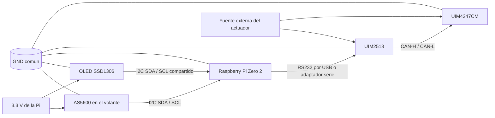

# Arquitectura de integracion con UIM2513

## Decision actual

Para mover el motor `UIM4247CM`, la ruta de comunicacion prevista es:

`Raspberry Pi Zero 2 -> RS232 -> UIM2513 -> CAN -> UIM4247CM`

La Raspberry Pi no debe manejar el motor directamente por GPIO. En esta etapa,
la Pi actua como nodo de supervision, lectura del AS5600, generacion de
consignas y registro de datos.

## Nota sobre el cambio de hardware

Se esta evaluando sustituir el enlace de laboratorio por un HAT para Raspberry
Pi con `CAN` y, si aplica, `RS485`. Esa idea solo funciona si el HAT ofrece un
`CAN` real y usable en Linux. Si solo entrega `RS485`, no reemplaza el camino
`RS232 -> CAN` que necesita el motor.

## Bloques

- `AS5600`: sensor absoluto del volante
- `Raspberry Pi Zero 2`: lectura, visualizacion y logica de alto nivel
- `UIM2513`: gateway RS232 a CAN
- `UIM4247CM`: actuador principal sobre la caja de direccion
- fuente externa: alimentacion del motor y del lado de potencia

## Diagrama de conexion



## Reglas de conexion

- El AS5600 y la OLED comparten el bus I2C de la Raspberry Pi.
- El motor no se alimenta desde la Pi.
- El UIM2513 queda como traductor entre la Pi y el bus CAN del motor.
- La referencia de tierra debe ser comun entre la parte logica y la parte de comunicacion.
- La forma fisica exacta del enlace RS232 depende del cable o adaptador que entregue el profesor.

## Interfaces que faltan confirmar

- tipo fisico de conexion entre la Pi y el UIM2513
  - USB a RS232
  - UART a RS232 mediante adaptador
  - otro enlace serial disponible
- velocidad serial del enlace RS232
- identificador CAN del motor
- comandos iniciales para posicion, habilitacion y parada

## Riesgos abiertos

- latencia del enlace serial
- necesidad de estado seguro ante perdida de comunicacion
- sentido de giro y escala angular
- limites mecanicos de la caja de direccion
- posicion inicial al encender

## Siguiente paso

Cuando el gateway este disponible, se debe:

1. Confirmar el enlace fisico RS232 con la Raspberry Pi.
2. Verificar que el UIM2513 responde.
3. Leer el motor y enviar un primer comando de movimiento pequeño.
4. Registrar respuesta, latencia y comportamiento de parada.
5. Comparar ese camino contra el HAT candidato antes de fijar arquitectura final.

## Programa preparado

El runtime preparado para este flujo es:

```bash
python3 tools/steer_by_wire_runtime.py
```

Si ya existe el enlace serial hacia el UIM2513, la forma de prueba es:

```bash
python3 tools/steer_by_wire_runtime.py --motor-port /dev/ttyUSB0 --motor-baud 115200
```

La plantilla de comando del motor se puede ajustar con:

```bash
python3 tools/steer_by_wire_runtime.py --motor-port /dev/ttyUSB0 --motor-template "TARGET {target_deg:.2f}"
```

Ese texto debe coincidir con el formato real que espere el UIM2513.
