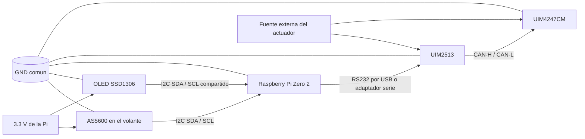

# Arquitectura de integracion con UIM2513

## Decision actual

Para mover el motor `UIM4247CM`, la ruta de comunicacion prevista es:

`Raspberry Pi Zero 2 -> RS232 -> UIM2513 -> CAN -> UIM4247CM`

La Raspberry Pi no debe manejar el motor directamente por GPIO. En esta etapa,
la Pi actua como nodo de supervision, lectura del AS5600, generacion de
consignas y registro de datos.

## Nota sobre el cambio de hardware

Se esta evaluando sustituir el enlace de laboratorio por un HAT para Raspberry
Pi con `CAN` y, si aplica, `RS485`. El candidato actual es el `WVS-14882`,
basado en `MCP2515`, porque expone `SocketCAN` en Linux y si puede reemplazar
la interfaz USB-RS232/UIM2513 como capa de acceso al bus.

El cambio solo funciona si:

- el HAT levanta `can0` sin errores
- el bitrate coincide con el del banco
- el protocolo del motor se implementa directamente sobre CAN

Si alguna de esas tres piezas falla, el HAT no elimina el trabajo pendiente,
solo cambia la interfaz fisica.

## Bloques

- `AS5600`: sensor absoluto del volante
- `Raspberry Pi Zero 2`: lectura, visualizacion y logica de alto nivel
- `UIM2513`: gateway RS232 a CAN
- `UIM4247CM`: actuador principal sobre la caja de direccion
- fuente externa: alimentacion del motor y del lado de potencia

## Lo que confirma el manual del motor

- El UIM342 trabaja con `CAN 2.0B` y permite bit rates desde `125 Kbps` hasta `1 Mbps`.
- El direccionamiento usa `Node ID`, `Group ID` y `Global ID`.
- Para movimiento simple, los comandos mas utiles son `MO`, `BG`, `ST`, `JV`, `PR` y `PA`.
- En CAN directo, el maestro usa `Producer ID = 4` y el motor arranca con `Consumer ID = 5`.
- El manual separa dos caminos: `CAN directo` o `RS232/Ethernet gateway` con mensajes UI.
- Si usamos el HAT `WVS-14882`, la meta es llegar a `CAN directo` y dejar la capa serial solo como respaldo.

## Diagrama de conexion



## Reglas de conexion

- El AS5600 y la OLED comparten el bus I2C de la Raspberry Pi.
- El motor no se alimenta desde la Pi.
- El UIM2513 queda como traductor entre la Pi y el bus CAN del motor.
- La referencia de tierra debe ser comun entre la parte logica y la parte de comunicacion.
- La forma fisica exacta del enlace RS232 depende del cable o adaptador que entregue el profesor.

## Interfaces que faltan confirmar

- tipo fisico de conexion entre la Pi y el UIM2513
  - USB a RS232
  - UART a RS232 mediante adaptador
  - otro enlace serial disponible
- velocidad serial del enlace RS232
- identificador CAN del motor
- comandos iniciales para posicion, habilitacion y parada

## Riesgos abiertos

- latencia del enlace serial
- necesidad de estado seguro ante perdida de comunicacion
- sentido de giro y escala angular
- limites mecanicos de la caja de direccion
- posicion inicial al encender

## Siguiente paso

Cuando el HAT este montado, se debe:

1. Confirmar que `can0` aparece en Linux.
2. Verificar el bitrate del bus.
3. Capturar las tramas de la red.
4. Enviar un primer mensaje de prueba al actuador.
5. Comparar ese camino contra el enlace con UIM2513 antes de fijar arquitectura final.

## Programa preparado

El runtime preparado para este flujo es:

```bash
python3 tools/steer_by_wire_runtime.py
```

Si el enlace serial hacia el UIM2513 sigue siendo el que se use, la forma de
prueba es:

```bash
python3 tools/steer_by_wire_runtime.py --motor-port /dev/ttyUSB0 --motor-baud 115200
```

La plantilla de comando del motor se puede ajustar con:

```bash
python3 tools/steer_by_wire_runtime.py --motor-port /dev/ttyUSB0 --motor-template "TARGET {target_deg:.2f}"
```

Ese texto debe coincidir con el formato real que espere el UIM2513.
