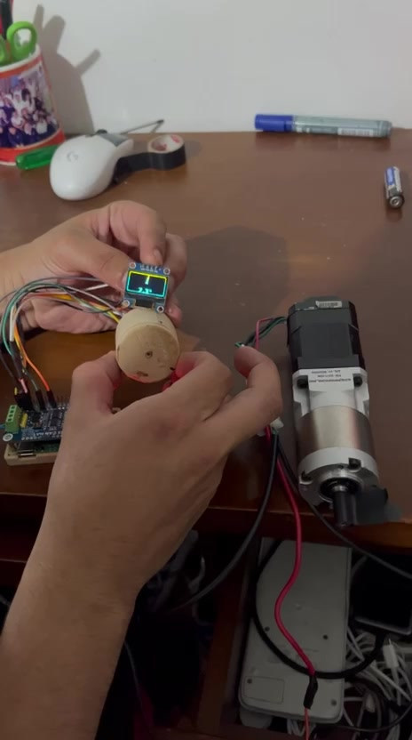

# Prueba de seguimiento del 5 de agosto de 2026

[Ver video completo](bench-follow-as5600-uim342.mp4)

## Que muestra

- Volante de prueba impreso con iman y AS5600.
- Angulo y flecha actualizados en la OLED.
- Raspberry Pi con HAT MCP2515.
- Motor UIM4247CM comandado directamente por CAN.
- Seguimiento visible entre el movimiento manual y el eje del motor.

## Resultado

La integracion completa funciona en banco para movimientos moderados. El video
tambien deja visible la principal limitacion mecanica: el soporte puede cambiar
la distancia y alineacion entre el iman y el AS5600 cuando se mueve con la mano.
El eje negro del motor no tiene una marca de alto contraste, por lo que este
video sirve como evidencia funcional pero no para medir latencia cuadro a
cuadro.

El montaje se considera una prueba funcional, no una validacion para vehiculo.
Los siguientes pasos son rigidizar el sensor y registrar telemetria cuantitativa.
