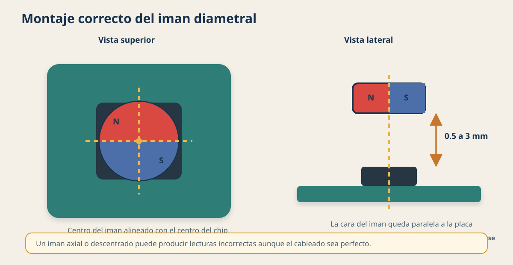

# Mini manual: AS5600 con Raspberry Pi Zero 2 W, ADS1115 y OLED

**Proyecto:** direccion steer-by-wire para prototipo Shell Eco-marathon  
**Version:** 1.0 - 30 de julio de 2026  
**Estado:** guia de conexion para pruebas de banco, sin actuador conectado

> [!WARNING]
> Este montaje sirve para desarrollar y validar un prototipo en banco. No debe
> controlar la direccion de un vehiculo en movimiento hasta agregar una capa de
> seguridad independiente, limites mecanicos y electricos, parada de emergencia,
> watchdog y pruebas documentadas.

## 1. Respuesta corta

Si, puedes leer simultaneamente el AS5600 por:

- **I2C:** entrega el angulo digital de 12 bits.
- **OUT analogico:** entrega un voltaje proporcional al angulo; el ADS1115 lo
  convierte a digital porque la Raspberry Pi no tiene entradas analogicas.

Usar las dos lecturas es util para diagnosticar discrepancias, pero **no es
redundancia de seguridad real**: ambas nacen del mismo chip, del mismo iman y de
la misma alimentacion.

Para la primera prueba de banco, alimenta el AS5600, el ADS1115 y una OLED I2C de
3.3 V desde la Raspberry Pi. Todos pueden compartir los pines SDA y SCL. No
conectes ningun motor ni su controlador a la alimentacion de 3.3 V de la
Raspberry Pi.

## 2. Como funciona el AS5600

El AS5600 es un sensor magnetico de posicion angular absoluta:

1. Se coloca un **iman diametral** sobre el centro del sensor.
2. Al girar el iman, los elementos Hall internos detectan la direccion del campo.
3. El chip calcula un valor de 12 bits entre `0` y `4095`.
4. Ese valor se puede leer por I2C y, al mismo tiempo, como voltaje analogico en
   `OUT` si la salida conserva su configuracion analogica.

La conversion digital basica es:

```text
angulo_grados = lectura_i2c * 360 / 4096
```

La resolucion teorica de una cuenta es:

```text
360 / 4096 = 0.0879 grados
```

Esto no significa que la exactitud mecanica final sea 0.0879 grados. La
alineacion, el iman, la holgura, el ruido y el montaje afectan la medicion.



### Limitacion importante: una sola vuelta

El AS5600 representa de forma absoluta una vuelta de `0` a `360 grados`. Al
cruzar el limite vuelve de `4095` a `0`.

Antes de usarlo en el volante debes medir el recorrido real:

- Si el volante gira menos de una vuelta de tope a tope, el AS5600 puede medirlo
  directamente, dejando margen antes de `0/360`.
- Si gira mas de una vuelta, una sola lectura absoluta no identifica en cual
  vuelta esta. Se necesita una relacion mecanica que lleve todo el recorrido a
  menos de 360 grados, un sensor multivuelta o una segunda estrategia de
  posicion absoluta.
- Contar vueltas por software puede servir en laboratorio, pero pierde la
  posicion multivuelta despues de un reinicio o una lectura omitida.

## 3. Los siete pines del modulo AS5600

El orden fisico varia entre placas. Conecta usando el **nombre impreso en la
placa**, no contando posiciones desde un extremo.

| Pin del modulo | Funcion | Conexion propuesta |
|---|---|---|
| `VCC` o `VDD` | Alimentacion positiva del modulo | `3.3 V` de la Raspberry Pi |
| `GND` | Referencia electrica comun | `GND` de la Raspberry Pi |
| `SDA` | Datos del bus I2C | GPIO2, pin fisico 3 |
| `SCL` | Reloj del bus I2C | GPIO3, pin fisico 5 |
| `OUT` | Salida analogica o PWM configurable | `A0` del ADS1115 |
| `DIR` | Define el sentido en que aumenta el angulo | `GND` para aumento horario, visto desde arriba |
| `PGO` | Entrada para programacion especial por `OUT` | Dejar sin conectar en uso normal |

> [!CAUTION]
> El nombre oficial es `PGO`, no `GPO`. Si tu placa dice `GPO`, toma una foto
> clara del frente y reverso antes de conectarla: puede ser una serigrafia
> distinta o un modulo con otro circuito.

### Pines que vamos a usar

Usaremos `VCC`, `GND`, `SDA`, `SCL`, `OUT` y `DIR`. `PGO` queda sin conectar.

`DIR` se fija a GND para comenzar. Si al montar el sensor el signo del giro queda
invertido, se puede cambiar a 3.3 V con el sistema apagado o invertir el signo
de forma documentada en el software. No se debe dejar `DIR` flotando.

## 4. Bus I2C compartido

I2C permite que varios dispositivos compartan los mismos dos cables. Cada uno
tiene una direccion:

| Dispositivo | Direccion esperada |
|---|---:|
| AS5600 | `0x36` fija |
| ADS1115 con `ADDR` a GND | `0x48` |
| OLED I2C comun | `0x3C`, a veces `0x3D` |

Estas direcciones no se superponen. Los tres modulos se conectan en paralelo a
SDA y SCL.


## 5. Conexion completa, cable por cable

Haz todo con la Raspberry Pi apagada y desconectada de su fuente.

### Raspberry Pi Zero 2 W

| Raspberry Pi | Destinos |
|---|---|
| Pin fisico 1 - `3V3` | `VCC` del AS5600, `VDD` del ADS1115 y `VCC` de la OLED |
| Pin fisico 6 - `GND` | `GND` de los tres modulos y `DIR` del AS5600 |
| Pin fisico 3 - GPIO2 / `SDA1` | `SDA` de los tres modulos |
| Pin fisico 5 - GPIO3 / `SCL1` | `SCL` de los tres modulos |

### Enlace analogico

| Origen | Destino |
|---|---|
| AS5600 `OUT` | ADS1115 `A0` o `AIN0` |

### Pines que quedan libres

| Modulo | Pin | Estado |
|---|---|---|
| AS5600 | `PGO` | Sin conectar |
| ADS1115 | `A1`, `A2`, `A3` | Sin conectar por ahora |
| ADS1115 | `ALRT` o `ALERT/RDY` | Sin conectar por ahora |
| ADS1115 | `ADDR` | A GND o en la configuracion predeterminada `0x48` de la placa |

### OLED

Esta guia supone una pantalla OLED de cuatro pines con interfaz I2C:
`GND`, `VCC`, `SCL` y `SDA`. Si la pantalla tiene pines como `CS`, `DC`,
`RES`, `D0` o `D1`, podria estar configurada para SPI y hay que revisar su
modelo antes de conectarla.

## 6. Por que todo debe trabajar a 3.3 V

Los GPIO de la Raspberry Pi trabajan a 3.3 V y no son tolerantes a 5 V. Muchas
placas I2C incluyen resistencias que elevan SDA y SCL hacia su propio `VCC`.

Por eso, para esta conexion:

- AS5600 a 3.3 V.
- ADS1115 a 3.3 V.
- OLED a 3.3 V, siempre que su placa indique que acepta 3.3 V.
- Todas las tierras unidas.
- No usar el pin de 5 V para estos modulos en la primera prueba.

No agregues resistencias pull-up externas al bus al principio. La Raspberry Pi
ya tiene elevacion en SDA/SCL y varias placas comerciales tambien incluyen
resistencias. En el montaje definitivo se debe medir y documentar la resistencia
equivalente del bus.

## 7. Puede la Raspberry Pi alimentarlo todo

Para una prueba de banco, normalmente si:

| Carga | Consumo orientativo |
|---|---:|
| AS5600 en modo normal | aproximadamente 6.5 mA |
| ADS1115, solo el chip | aproximadamente 0.15 mA |
| OLED pequena | depende del modelo y de los pixeles encendidos; estimar 20 a 30 mA |
| Total de perifericos | aproximadamente 30 a 50 mA |

El consumo real de placas genericas puede ser mayor por LEDs, reguladores y
resistencias incorporadas. La fuente principal de la Raspberry Pi debe ser una
fuente estable de **5 V y 2 A** para el trabajo de banco.

Para el vehiculo:

- Usa un convertidor DC-DC regulado y protegido para alimentar la Raspberry Pi.
- Separa la potencia del motor de direccion de la alimentacion logica.
- El motor necesita su propio controlador y fuente dimensionados; nunca se
  conecta a un GPIO ni al pin de 3.3 V.
- Agrega fusible, proteccion contra polaridad inversa, transitorios y caidas de
  tension.

## 8. Que seguridad aporta la doble lectura

La comparacion puede detectar algunas fallas:

- Cable `OUT` cortado o lectura del ADS1115 bloqueada.
- Error de conversion o configuracion del ADS1115.
- Diferencia excesiva entre la curva analogica calibrada y el registro I2C.
- Salida analogica fija mientras I2C cambia, o viceversa.

No puede cubrir por si sola:

- Iman desprendido, descentrado o demasiado lejos.
- Chip AS5600 averiado.
- Alimentacion comun perdida.
- Acople mecanico del sensor suelto.
- Error comun dentro del calculo angular del AS5600.
- Raspberry Pi bloqueada.

Para una redundancia de seguridad mas seria se necesitan dos canales con la
mayor independencia posible: dos sensores, montajes y alimentaciones
supervisadas, comparacion de plausibilidad y una capa de control capaz de llevar
el actuador a un estado seguro aunque Linux se bloquee.

La Raspberry Pi Zero 2 W puede servir para desarrollo, interfaz, registro y
supervision, pero no debe considerarse automaticamente un controlador de
seguridad.

## 9. Estrategia de lectura recomendada

1. Leer `RAW ANGLE` por I2C en la direccion `0x36`.
2. Leer el bit `MD` y los indicadores `ML/MH` del registro `STATUS`.
3. Leer `A0` del ADS1115 con rango de entrada de `+-4.096 V`.
4. Convertir ambas mediciones a grados.
5. Aplicar calibracion al canal analogico usando los valores medidos en los
   extremos reales.
6. Comparar ambas lecturas teniendo en cuenta el salto `359 -> 0`.
7. Si la diferencia supera un umbral durante varias muestras, declarar falla,
   deshabilitar el mando del actuador y registrar el evento.
8. Mostrar en la OLED angulo, estado del iman y estado `OK/FALLA`.

No programes todavia la memoria OTP del AS5600. Los comandos de quemado son
limitados y algunos ajustes solo se pueden grabar permanentemente una vez.
Primero se probaran los registros volatiles.

## 10. Verificacion cuando vuelvas a encender

Despues de habilitar I2C en Raspberry Pi OS, la comprobacion inicial sera:

```bash
sudo raspi-config
```

Entra a `Interface Options` > `I2C` > `Enable`. Luego:

```bash
i2cdetect -y 1
```

Se espera ver:

```text
0x36  AS5600
0x48  ADS1115
0x3C  OLED, o posiblemente 0x3D
```

Si `i2cdetect` no existe, se instalara `i2c-tools` cuando la Raspberry Pi tenga
acceso a Internet.

### Prueba visual de la OLED

Cuando la OLED ya responda en `0x3C`, el monitor de la flecha se puede ejecutar
en modo vivo para ver el angulo variar con el AS5600:

```bash
python3 ~/Documentos/steer-by-wire/tests/oled_compass.py
```

Si quieres comprobar solo una posicion concreta, usa:

```bash
python3 ~/Documentos/steer-by-wire/tests/oled_compass.py --angle 90
```

## 11. Lista de comprobacion antes de energizar

- [ ] La Raspberry Pi esta apagada y desconectada.
- [ ] Se verificaron las etiquetas exactas de cada placa.
- [ ] Ningun cable de 5 V llega a SDA, SCL, OUT o A0.
- [ ] Los tres modulos reciben 3.3 V.
- [ ] Todas las tierras estan unidas.
- [ ] `OUT` del AS5600 llega solamente a `A0` del ADS1115.
- [ ] `PGO` queda sin conectar.
- [ ] `DIR` esta conectado a GND.
- [ ] No hay motor ni driver de motor conectado en esta etapa.
- [ ] El iman es diametral, esta centrado y no roza el sensor.
- [ ] Se tomaron fotos del cableado para la documentacion.

## 12. Montaje del iman

La cara del iman debe quedar paralela a la placa y su eje de rotacion debe pasar
por el centro del chip:

- Iman de magnetizacion diametral, no axial.
- Separacion tipica indicada por el fabricante: 0.5 a 3 mm, segun el iman.
- Con un iman de 6 mm, el fabricante indica un descentramiento maximo orientativo
  de 0.25 mm.
- La lectura `AGC` debe quedar lejos de sus extremos; `ML` indica campo debil y
  `MH` campo fuerte.
- El iman debe quedar retenido mecanicamente. No confiar solo en adhesivo para
  una aplicacion de direccion.

## 13. Fuentes tecnicas

- Infineon/ams OSRAM, [AS5600 datasheet](https://www.infineon.com/assets/row/public/documents/24/49/infineon-as5600-datasheet-en.pdf).
- ams OSRAM, [manual de la placa de referencia AS5600 de siete pines](https://look.ams-osram.com/m/8a0660dd2b70f413/original/AS5600_UG000240_1-00.pdf).
- Texas Instruments, [ADS1115 datasheet](https://www.ti.com/lit/gpn/ads1115).
- Raspberry Pi, [documentacion de GPIO y Raspberry Pi Zero 2 W](https://www.raspberrypi.com/documentation/computers/raspberry-pi.html).

## 14. Informacion que falta confirmar

Antes de energizar, conviene tomar una foto nitida del frente y reverso de:

1. La placa AS5600.
2. La placa ADS1115.
3. La OLED.

Con esas fotos se puede confirmar el orden fisico, la presencia de reguladores,
las resistencias pull-up y el voltaje aceptado por la OLED. Este manual define
la conexion electrica correcta por nombre de señal, pero no adivina el orden de
pines de una placa generica.
